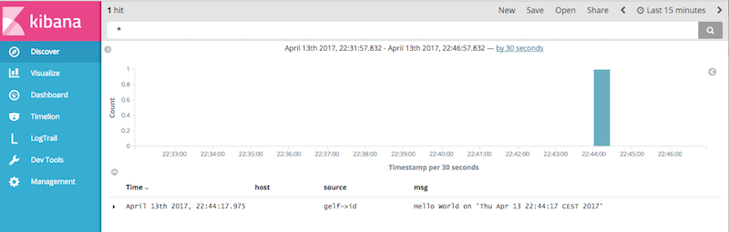

# qwatch-static
Statically compiled ETL framework for logs/events


## Container Development

As my Mac behaves crazy, I use a ubuntu container to develop.

#### Start the stack
Elasticsearch and kibana to store and view messages.

```bash
$ docker stack deploy -c docker-compose.yml qwatch
Creating service qwatch_backend
Creating service qwatch_frontend
$ 
```

You can reach them under [http://localhost:9200/_cat/indices](http://localhost:9200/_cat/indices) and [http://localhost:5601](http://localhost:5601).

#### Start the DEV container

```bash
$ docker run -ti --name qwatch-static --rm -e SKIP_ENTRYPOINTS=1 \
           -v $(pwd)/resources/bash_history:/root/.bash_history:ro \
           -v ${GOPATH}/src/github.com/qnib/qframe-collector-gelf:/usr/local/src/github.com/qnib/qframe-collector-gelf \
           -v ${GOPATH}/src/github.com/qnib/qframe-filter-grok:/usr/local/src/github.com/qnib/qframe-filter-grok \
           -v ${GOPATH}/src/github.com/qnib/qframe-handler-influxdb:/usr/local/src/github.com/qnib/qframe-handler-influxdb \
           -v ${GOPATH}/src/github.com/qnib/qframe-handler-elasticsearch:/usr/local/src/github.com/qnib/qframe-handler-elasticsearch \
           -v ${GOPATH}/src/github.com/qnib/qframe-utils:/usr/local/src/github.com/qnib/qframe-utils \
           -v ${GOPATH}/src/github.com/qnib/qframe-types:/usr/local/src/github.com/qnib/qframe-types \
           -v $(pwd):/usr/local/src/github.com/qnib/$(basename $(pwd)) \
           -w /usr/local/src/github.com/qnib/$(basename $(pwd)) qnib/uplain-golang bash
root@b85f3383012a:/usr/local/src/github.com/qnib/qwatch-static# govendor list
 v  github.com/BurntSushi/toml
 v  github.com/OwnLocal/goes
 v  github.com/codegangsta/cli
 v  github.com/ghodss/yaml
 v  github.com/go-ini/ini
 v  github.com/grafov/bcast
 v  github.com/hpcloud/tail
 v  github.com/hpcloud/tail/ratelimiter
 v  github.com/hpcloud/tail/util
 v  github.com/hpcloud/tail/watch
 v  github.com/hpcloud/tail/winfile
 v  github.com/qnib/qframe-collector-file/lib
 v  github.com/qnib/qframe-collector-gelf/lib
 v  github.com/qnib/qframe-filter-id/lib
 v  github.com/qnib/qframe-handler-elasticsearch/lib
 v  github.com/qnib/qframe-types
 v  github.com/qnib/qframe-utils
pv  github.com/qnib/qwatch-static
 v  github.com/zpatrick/go-config
 v  gopkg.in/fsnotify.v1
 v  gopkg.in/tomb.v1
 v  gopkg.in/yaml.v2
pl  github.com/qnib/qwatch-static
```

Now I can hack a bit on `qwatch-static` and start the daemon.

```bash
root@afa150b5fbdd:/usr/local/src/github.com/qnib/qwatch-static# govendor update +l ; go run main.go --config resources/qwatch-container.yml
2017/04/13 20:26:25 [II] Start Version: 0.1.0
2017/04/13 20:26:25 [II] Use config file: resources/qwatch-container.yml
2017/04/13 20:26:25 [II] Dispatch broadcast for Data and Tick
2017/04/13 20:26:25 [II] Start elasticsearch handler: es_logsv0.1.1
2017/04/13 20:26:25 [II] Start GELF collector gelf v0.1.0
2017/04/13 20:26:25 [II] Start id filter '%s' id
2017/04/13 20:26:25 [II] Start elasticsearch handler: es_eventsv0.1.1
2017/04/13 20:26:25 [II] Start file collector v0.0.2
2017/04/13 20:26:25 [II] Start GELF server on ':12201'
2017/04/13 20:26:25 [DD] Index '[]' does not exists
2017/04/13 20:26:25 [DD] Index '[]' does not exists
2017/04/13 20:26:25 [WW] Index '' could not be created
2017/04/13 20:26:25 [WW] Index '' could not be created
2017/04/13 20:26:25 [II] Wait for incomming GELF message
2017/04/13 20:26:25 [DD] Index '[logs-2017-04-13]' does not exists
2017/04/13 20:26:25 [WW] Index 'logs-2017-04-13' could not be created
2017/04/13 20:26:25 [DD] Index '[events-2017-04-13]' does not exists
2017/04/13 20:26:25 [WW] Index 'events-2017-04-13' could not be created
```

#### Trigger GELF

To issue an GELF message against the `qwatch-static` daemon, just use the little helper-script.

```bash
$ ./resources/bin/fire_gelf.sh "Hello World on '$(date)'"                                                                                                                                                                                       git:(master|✚3
  Hello World on 'Thu Apr 13 22:32:20 CEST 2017'
```

### View messages in kibana

Now please set up the index patterns in kibana (I have to figure out how to automate this).
Afterwards the views and dashboards can be set up using the `resources/kibana.json` file, which can be imported to kibana. 


