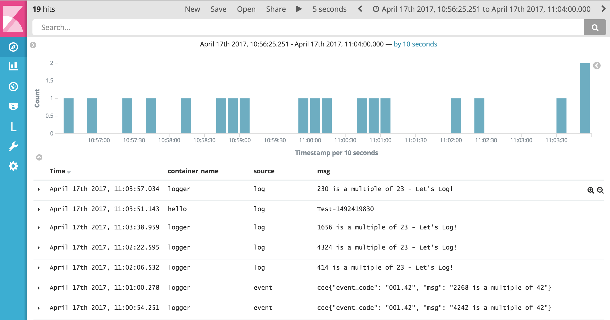
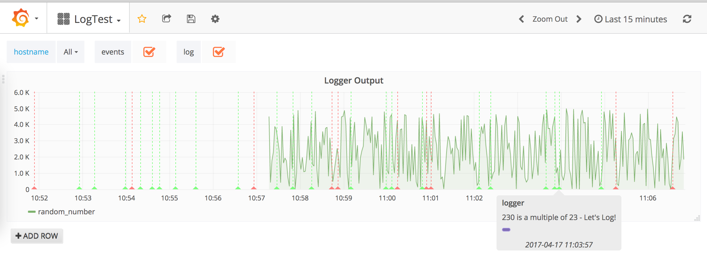
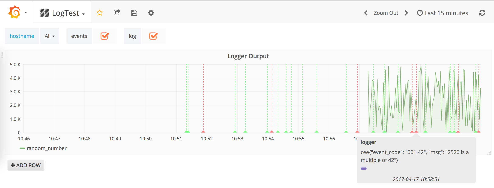

# Log/Event/Metrics Handling

In this proposal the handling of logs,events and metrics using the container's stdout/stderr is explained using a small prototype.

## Problem
Handling data emitted by a container is different from traditional machines (virtual/physical), because the containers are not pre-defined in their configuration but scheduled by the docker-engine.<br>
Thus, the collection mechanism does not know hostnames, ip-addresses and alike in advance and has to annotate them on-demand.

## stdout/stderr Approach
The docker-engine provides log-plugins as well as API calls to hook into the streams of console output of each container, which is enriched with information neccessary to handle the information.

The general idea is to output logs, events and metrics to the console of each container and collect them.<br>
Doing so, the following assumption are made about the format of the different outputs:

- **metrics** are formatted in OpenTSDB format <br>
  `put <metric-name> <unixepoch> <metric-value> [<tags>]...`
- **events** are emitted using `cee` logs <br>
  `cee{"event_code": "<event_code>", "msg": "<msg>"}`
- **logs** are unstructured. Each output not formatted as `metric` or `event` are considered to be a log.

## Example Application

The following example script will emit random numbers as metrics.

```
  1 #!/bin/bash
  2
  3 log=23
  4 event=42
  5
  6 while [ true ];do
  7     r=$((${RANDOM}%5000))
  8     echo "put random_number $(date +%s) $r script=logger.sh,hostname=$(hostname)"
  9     if [[ $(($r%${log})) -eq 0 ]];then
 10         echo "${r} is a multiple of ${log} - Let's Log!"
 11     fi
 12     if [[ $(($r%${event})) -eq 0 ]];then
 13         msg="${r} is a multiple of ${event}"
 14         ec="001.${event}"
 15         echo "cee{\"event_code\": \"${ec}\", \"msg\": \"${msg}\"}"
 16     fi
 17     sleep ${1:-5}
 18 done
```

Each time the number is a multiple of `23` a log is created. In case the number can be divided by `42` an event will be send to the console.

## GELF logdriver
This script is started within a container, which uses the log-driver `gelf` to relay the output to a central logging server, which annotates the log with information about the container, the command executed and more.

```
$ docker run -d --name logger --log-driver gelf \
				 --log-opt gelf-address=udp://${CNT_IP}:12201 \
				 --log-opt gelf-compression-type=none \
				 debian:latest ./logger.sh $@
```

The message `1403 is a multiple of 23 - Let's Log!` will be received as JSON blob by the GELF endpoint.

```
{
"version":"1.1",
"host":"moby",
"short_message":"1403 is a multiple of 23 - Let's Log!",
"timestamp":1.492277689422e+09,
"level":6,
"_command":"/data/bin/logger.sh 2", 
"_container_id":"e2fbd0da4125dc6879f27bf4a009e44db1ad0ff48aa4e742d980875d61a9b54e",
"_container_name":"logger",
"_created":"2017-04-15T17:32:44.002585042Z",
"_image_id":"sha256:8cedef9d7368741f8539f3c984dee7c3a5953ef69178585e6da188255e12223d",
"_image_name":"debian:latest",
"_tag":"e2fbd0da4125"
}
```

## Collection agent

A receiving log agent has to determine, whether the message is an event or a metric. If not it is considered to be a log.

A prototypical daemon with this pipeline configuration:

```
collector:
  gelf:
    port: "12201"

filter:
  metric:
    inputs: "gelf"
    pattern: "put %{WORD:name} %{POSINT:time} %{BASE10NUM:value}( %{GREEDYDATA:tags})?"
  event:
    inputs: "metric"
    source-success: false
    pattern: "cee%{GREEDYDATA:event_json}"
  log:
    inputs: "event"
    source-success: false
    pattern: "%{GREEDYDATA:log_message}"

handler:
  es_logstash:
    host: "172.17.0.1"
    inputs: "log,event"
  influxdb:
    inputs: "metric"
    database: "qcollect"
    precision: "s"
    host: "172.17.0.1"
```

...will exactly do that.

1. **collector.gelf** Receive messages via GELF 
1. **filter.metric** A grok filter matching of the OpenTSDB format.
1. **filter.event** If the previous match is not successful, this grok filter matches cee events.
1. **filter.log** In case the messages is also not matched by the event filter, the message is considered a log.
1. **handler.es_logstash** Log and events are send to elasticsearch.
1. **handler.influxdb** metrics are send to the metrics backend influxdb.

```
$ go run main.go --config resources/qwatch-container.yml
2017/04/15 17:35:11 [II] Start Version: 0.2.0
2017/04/15 17:35:11 [II] Use config file: resources/qwatch-container.yml
2017/04/15 17:35:11 [II] Dispatch broadcast for Data and Tick
2017/04/15 17:35:11 [  INFO] influxdb >> Start log handler influxdbv0.0.0
2017/04/15 17:35:11 [  INFO] influxdb >> Established connection to 'http://172.17.0.1:8086
2017/04/15 17:35:11 [II] Start grok filter 'log' v0.1.2
2017/04/15 17:35:11 [II] Start grok filter 'metric' v0.1.2
2017/04/15 17:35:11 [II] Start grok filter 'event' v0.1.2
2017/04/15 17:35:11 [II] Start GELF collector gelf v0.1.0
2017/04/15 17:35:11 [  INFO] es_logstash >> Start elasticsearch handler: es_logstashv0.1.3
2017/04/15 17:35:11 [II] Start GELF server on ':12201'
2017/04/15 17:35:11 [II] Wait for incomming GELF message
```
## Result

The logs/events can be view using kibana5:



Metrics are graphed using grafana, which also annotates the graph with events/logs from elasticsearch.



